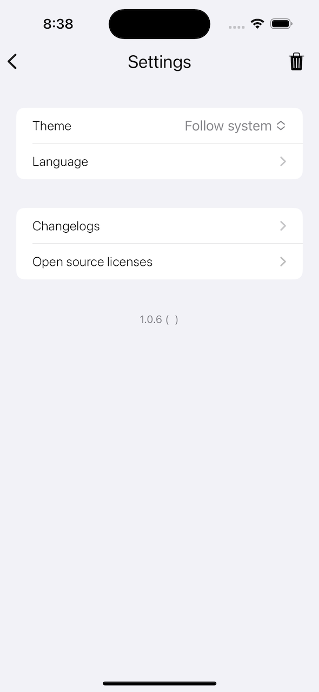

<h1>
Bingpaper 

</h1>

A practical iOS Bing wallpaper App 

## Features
- [x] Widgets
- [x] Switch to Dark & Light Modes Manually
- [x] App and widget localization (简体中文、English)
- [x] SwiftUI / Async / Await

## Compatibility
Requires **iOS 15.0** or later.

## Changelogs
- [简体中文](changelogs/CHANGELOG_SC.md)
- [English](changelogs/CHANGELOG.md)

## Snapshots

## Dependencies

- [AlertToast](https://github.com/elai950/AlertToast)
- [Kingfisher](https://github.com/onevcat/Kingfisher)

